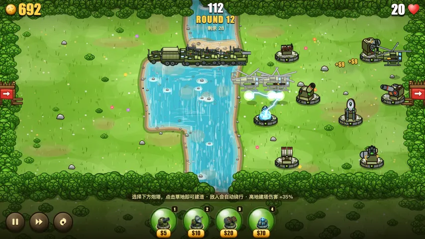
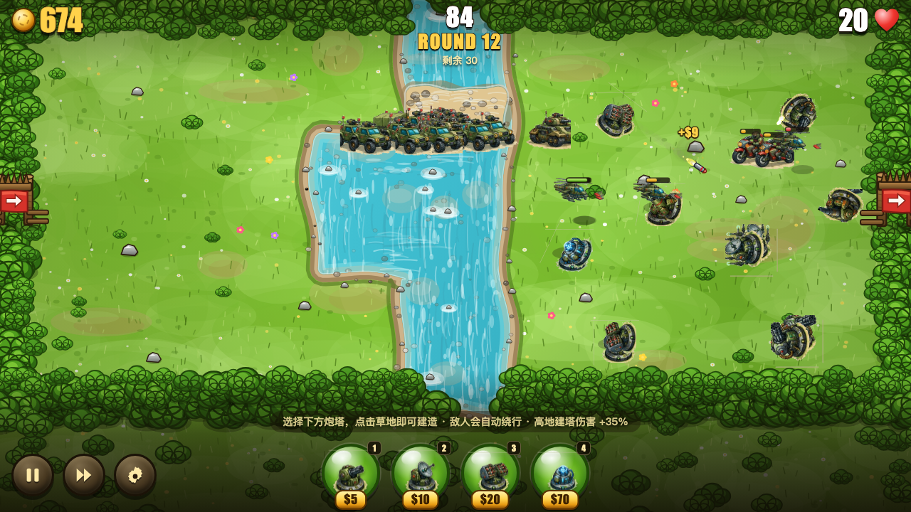
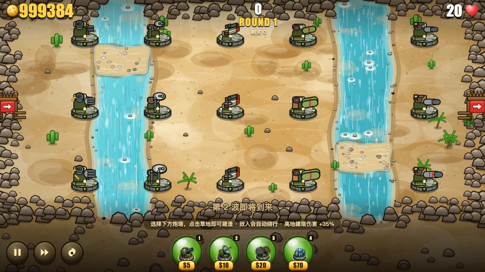
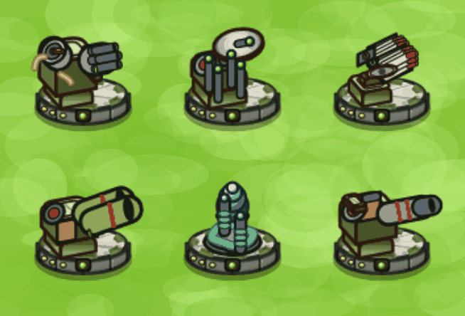
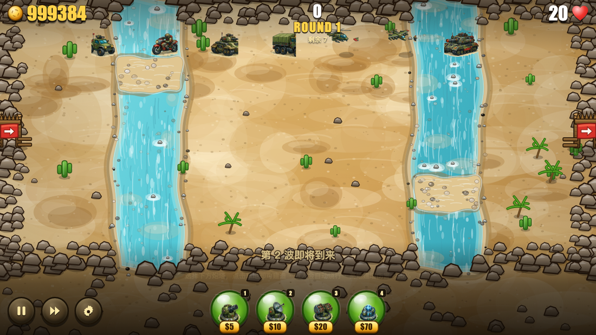
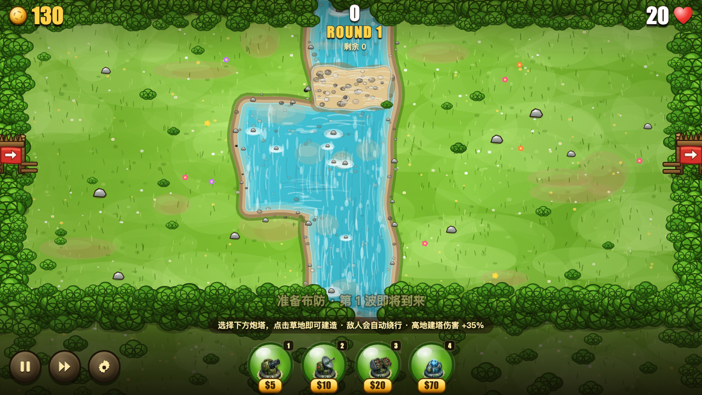
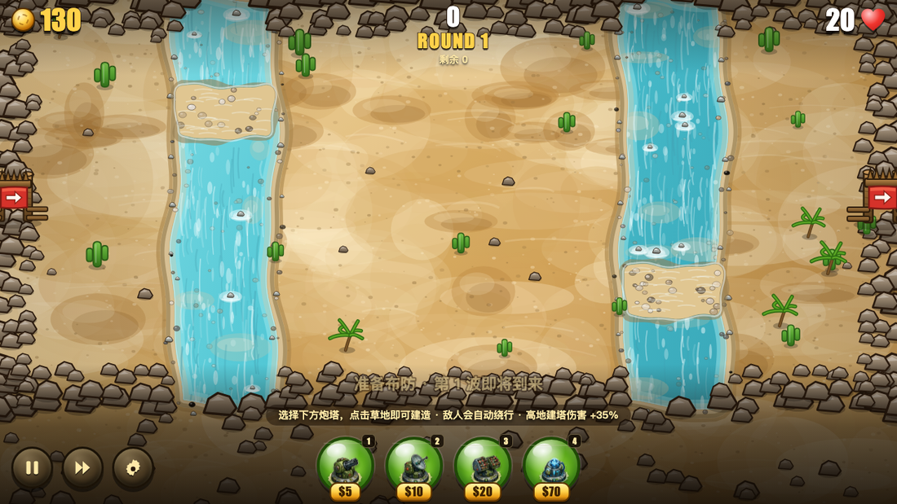
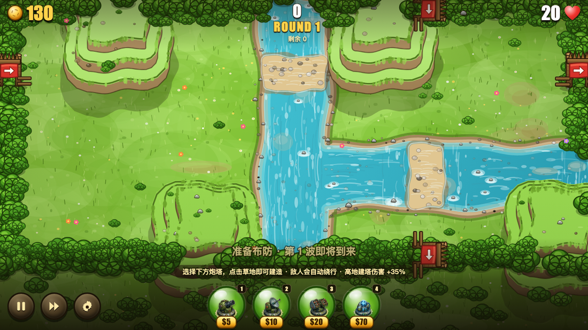
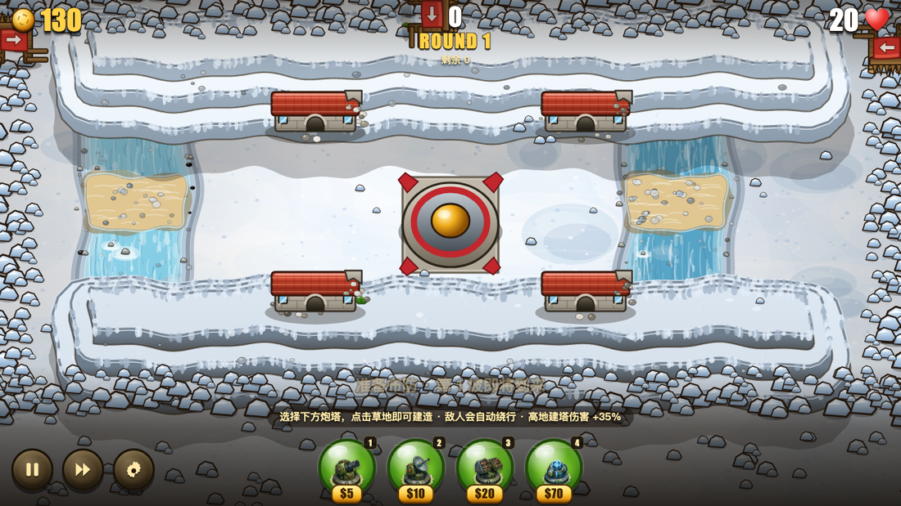

<div align="center">

# FIELDRUNNERS · 坚守阵地

**自由摆放炮塔，让敌人绕出一条死亡长廊。**

一个零依赖、纯 Canvas 2D 的塔防游戏，致敬 Subatomic Studios 的经典之作 *Fieldrunners*。
所有美术与音效都在运行时程序化生成 —— 没有一张图片资源，没有一个音频文件。




<sub>（若动图未播放，[点这里看 GIF 版本](docs/demo.gif)）</sub>

</div>

---

## 这是什么

一局塔防里最爽的时刻，不是数值碾压，而是**看着敌人乖乖走进你亲手设计的那条弯路**。

《坚守阵地》把这件事做成了核心机制：炮塔可以摆在**任何一块空地**上，而敌人会**实时重新寻路**绕开它们。
于是你摆下的每一座塔，都不只是"一个输出点"，而是**地形本身** —— 你在用炮塔给敌人修一条它不得不走的路。

本作把原作这套机制完整复刻了下来：

- **自由摆放 + 自动绕行** —— 敌人永远走当前最短的路，你随时可以改路
- **但封不死** —— 试图把路线完全堵死时，系统会拒绝这次建造
- **蛇形长廊** —— 用塔墙把敌人的行进距离拉长十倍，是通关的唯一正解

<div align="center">

</div>

---

## 核心玩法

### 1. 塔就是路

点击底部炮塔按钮 → 点击任意草地即可建造（也可以直接从按钮拖拽到地图上）。
建好的瞬间，所有敌人会立刻重新规划路线 —— **你摆的是塔，改的是地形。**

> 试着用一排塔把敌人从地图正中挤到左上角，再在拐角处堆满火焰塔。
> 敌人走进这条走廊需要 40 秒，而它本来只需要 9 秒。这就是"坚守阵地"。

### 2. 但你不能把路封死

系统在每次建造前会跑一遍完整的寻路验证：如果这次建造会让某个敌人**再也走不到基地**，
建造会被拒绝，并弹出提示。所以你不能靠"堵门"取胜 —— 只能靠"绕远"。

### 3. 拖长，然后磨死它

每漏过一名敌人扣 **1 点生命**，共 **20 点**。
敌人的血量随波次持续增长，而地图上的格子是有限的 —— 到了后期，**唯一的变量就是你能把敌人困住多久**。

### 4. 高地是白送的火力

高地（`^`）上可以建塔，且该塔**伤害 +35%**；但敌人爬不上高地，只能绕行。
换句话说：**高地既是墙，也是炮台**。把塔阵的关键节点压在高地上，性价比极高。

---

## 六种炮塔

<div align="center">

</div>

| 炮塔 | 造价 | 定位 | 一级 DPS | 满级 DPS | 对空 |
|:--|--:|:--|--:|--:|:--:|
| 🎯 **机枪塔** Gatling | **$5** | 高射速单体，最便宜的填格工具 | 20 | 96 | ✅ |
| 🟢 **胶水塔** Goo | **$10** | 大幅减速 + 小范围溅射，越早升越好 | 6 | 40 | ✅ |
| 🚀 **导弹塔** Missile | **$20** | 追踪 + 爆炸溅射，万金油主力 | 27 | 203 | ✅ |
| 🔥 **火焰塔** Flame | **$50** | 近距离持续喷射，秒伤爆炸 | 80 | 330 | ❌ |
| ⚡ **电磁塔** Tesla | **$70** | 连锁闪电，专治密集队列 | 60 | 330 | ✅ |
| 💥 **迫击炮** Mortar | **$120** | 超远射程曲射，大范围溅射 | 50 | 284 | ❌ |

**通用规则**

- 每种炮塔可**升级两次**，每次威力约翻倍，升级费用约等于建造价 —— 各级性价比基本持平
- 出售返还 **70%** 已投入资金
- 点击已建造的炮塔，可以**升级 / 出售 / 切换目标优先级**：`最前` · `最后` · `最强` · `最近`
- ⚠️ 火焰塔与迫击炮**打不到空中**，必须搭配对空塔

> **别只看 DPS/$。** 机枪塔的 DPS/$ 最高，但射程最短 —— 在大棋盘上纯机枪流比混编差一半以上。
> 便宜的塔怕装甲，昂贵的塔靠射程 / 溅射 / 连锁 / 减速取胜。

<div align="center">

</div>

---

## 七种敌人

<div align="center">

</div>

| 敌人 | 血量 | 速度 | 护甲 | 悬赏 | 备注 |
|:--|--:|--:|--:|--:|:--|
| 侦察吉普 infantry | 42 | 44 | 0 | $5 | 全程主力，量大 |
| 摩托兵 runner | 56 | **84** | 0 | $7 | 第 3 波起，极快 |
| 轻型坦克 commando | 128 | 48 | 2 | $11 | 第 9 波起，开始吃护甲 |
| 装甲卡车 truck | **340** | 33 | **5** | $22 | 第 14 波起，肉盾 |
| 🚁 武装直升机 heli | 105 | 66 | 1 | $13 | 第 6 波起 · **空中** |
| ✈️ 轰炸机 bomber | 250 | 58 | 3 | $26 | 第 18 波起 · **空中** |
| ☠️ 重装指挥车 boss | **2600** | 27 | **9** | $160 | 每 10 波登场一次 |

**两种空中单位无视地形与路径，直线飞向基地** —— 河、高地、房屋统统拦不住它们。
你只能在飞行路线上布置对空炮塔（机枪 / 胶水 / 导弹 / 电磁）硬拦。

**重装指挥车护甲 9** —— 低伤害炮塔打在它身上几乎无效，必须靠火焰、电磁或迫击炮。

---

## 地形

| 地形 | 可通行 | 可建造 | 效果 |
|:--|:--:|:--:|:--|
| 🟩 平地 `.` | ✅ | ✅ | — |
| 🟦 河流 `~` | ❌ | ❌ | 天然屏障，逼敌人走固定路线 |
| 🩵 浅滩 `=` | ✅ | ❌ | 敌人涉水时**速度降到 55%** —— 最佳埋伏点 |
| 🟨 高地 `^` | ❌ | ✅ | 建在上面的炮塔**伤害 +35%** |
| 🟫 房屋 `#` | ❌ | ❌ | 纯阻挡物 |
| 🏰 基地 `B` | ❌ | ❌ | 敌人的最终目标 |

浅滩是整张地图上最值钱的两三个格子：**唯一的过河点 + 55% 减速**，
意味着敌人的整支队伍会在这里排队送死。

---

## 四张地图

<div align="center">


</div>
<div align="center">


</div>

| 地图 | 难度 | 特征 |
|:--|:--|:--|
| 🌿 **草原** Grasslands | 入门 | 单一入口。一条大河纵贯全图，中段水面骤宽，唯一渡口在上游 —— 敌人只能从那里涉水 |
| 🏜️ **荒漠** Drylands | 普通 | 单一入口。两条沙河把地图切成三段，浅滩一上一下错开，敌人被迫走之字形 |
| ➕ **十字路口** Crossroads | 进阶 | 两条河道十字交汇，两处来路各只有一个渡口；场上散布高地 |
| ❄️ **霜寒之地** Frostbite | 困难 | 三面夹击、汇聚中央基地。一道高地长墙横贯全图，两侧冰河各只有一个渡口 |

> **霜寒之地为什么最难？** 是几何决定的，不是数值调的。
> 基地在正中央，正上方出生点的直线距离只有约 600px —— 炮塔根本来不及输出。
> 所以那张图加了一道横贯全图的高地长墙，把三路敌人都逼到地图两端才能下城。
> 而高地可以建造，等于把城墙本身送给你当火力平台。

---

## 模式与难度

**三种模式**

| 模式 | 波数 | 说明 |
|:--|:--|:--|
| 经典 | 100 波 | 仅开放原作四塔：机枪 / 胶水 / 导弹 / 电磁 |
| 扩展 | 100 波 | 追加火焰塔与迫击炮，六塔全开 |
| 无尽 | ∞ | 波次无上限，敌军强度持续攀升，挑战最高分 |

**三档难度**

| 难度 | 初始资金 | 敌军强度 | 击杀收益 |
|:--|--:|--:|--:|
| 简单 | $170 | 82% | 115% |
| 普通 | $130 | 100% | 100% |
| 高手 | $100 | 128% | 90% |

> 实测强度：**强玩家（蛇形迷宫 + 六塔混编 + 全升级）能稳定打到 80+ 波**，休闲玩法约 25~35 波。

---

## 操作

| 按键 | 功能 |
|:--|:--|
| `1` – `6` | 选择炮塔 |
| 鼠标左键 | 建造 / 选中炮塔 |
| `Esc` · 鼠标右键 | 取消选择 |
| `空格` | 暂停 / 继续 |
| `F` | 加速 2 倍 |
| `U` | 升级选中的炮塔 |
| `S` | 出售选中的炮塔 |

底部工具栏会实时显示每座塔的价格与当前可购状态。选中已建炮塔后，可以升级、切换目标优先级、或出售。

---

## 快速开始

```bash
git clone https://github.com/yongsoft/FieldRunners.git
cd FieldRunners
```

然后**双击 `index.html`** 即可。

没有构建步骤、没有 `npm install`、没有本地服务器 —— 直接 `file://` 打开就能玩。

> 想改数值？几乎所有平衡参数都集中在 [`js/config.js`](js/config.js) 一个文件里：
> 炮塔、敌人、地图、波次成长曲线、难度修正。

---

## 技术实现

| | |
|:--|:--|
| **渲染** | 单张 1280×720 逻辑画布，CSS `transform: scale()` 自适应；固定逻辑分辨率，与屏幕尺寸解耦 |
| **美术** | **100% 运行时程序化绘制** —— 没有一个图片文件。厚涂卡通 + 粗黑描边，炮塔与敌人带离屏 sprite 缓存 |
| **投影** | 真 3/4 斜视角（`u` 前 / `v` 右 / `w` 上），带相机侧深度排序与遮挡规则 |
| **寻路** | **每个出口一张流场**：16px 细网格（80×36）上的 8 向 BFS，切比雪夫距离 + 视线拉绳平滑 |
| **建塔校验** | 建造 → 重建阻挡 → 重建流场 → 全路径合法性检查；不合法则**整体回滚** |
| **音效** | WebAudio 程序化合成，按帧节流，防止多塔齐射爆音 |
| **依赖** | 无。纯原生 JavaScript + Canvas 2D + WebAudio |
| **性能** | 30 座炮塔 + 54 名敌人：**3.9 ms/帧**（热态） |

```
FieldRunners/
├── index.html          入口
├── css/style.css       HUD / 菜单 / 布局
└── js/
    ├── config.js       炮塔 · 敌人 · 地图 · 波次 · 难度（调平衡看这里）
    ├── art.js          全部程序化美术 + 3/4 斜视角投影引擎
    ├── audio.js        WebAudio 程序化音效
    ├── engine.js       游戏循环 · 流场寻路 · 战斗结算
    ├── ui.js           HUD · 菜单 · 炮塔面板
    └── main.js         启动 · 画布自适应 · 主循环
```

---

## 致敬声明

*Fieldrunners* 由 **Subatomic Studios** 开发，本作是对它的**非商业性致敬复刻** ——
玩法机制与视觉风格均参照原作，代码与美术为完全独立实现（全部程序化生成，未使用原作任何素材）。

原作版权归 Subatomic Studios 所有。本仓库仅供学习与交流，请勿用于任何商业用途。

---

<div align="center">
<sub>用一堆炮塔，和一条它不得不走的路。</sub>
</div>
